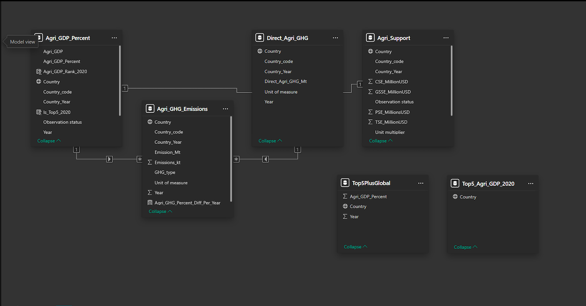
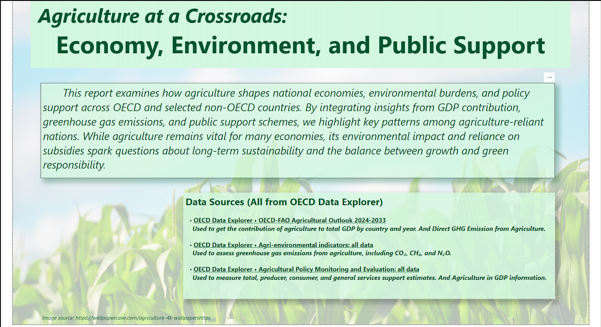
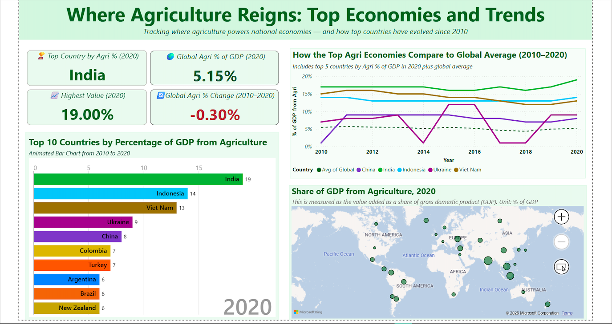
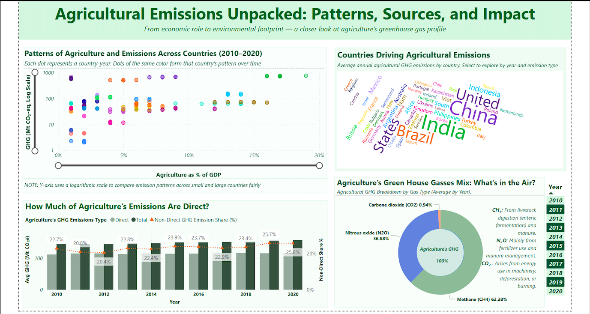
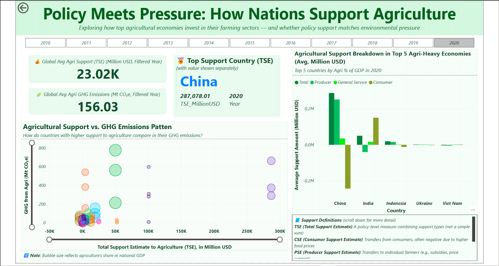

# Agriculture, Economy, and Emissions Analysis

This project analyzes how agriculture contributes to national economies, drives greenhouse gas emissions, and is supported by government policy, using OECD data and a Power BI dashboard.

The aim is to explore whether countries are balancing economic reliance on agriculture with environmental sustainability.

## Project overview

The analysis brings together three perspectives:
- Agriculture’s share of GDP  
- Agricultural greenhouse gas emissions  
- Government support to agriculture (TSE)  

By combining these datasets, the report allows comparison across countries and over time (2010–2020).

## Data and modelling

Multiple OECD datasets were integrated through a simple ETL process:
- Standardised country names and time formats  
- Cleaned missing and inconsistent records  
- Aligned units (e.g. % of GDP, Mt CO₂e)  
- Created a consistent country–year structure  

In Power BI:
- Relationships were built across datasets to enable cross-filtering  
- DAX measures were used to calculate trends, averages, and comparisons  

### Model view

The model links datasets by country and year, allowing consistent comparison across economic, environmental, and policy indicators.

## Key insights

**Economic role**
- Agriculture contributes a relatively small share globally (~5%), but remains significant in countries like India (~19%) and Indonesia (~14%)  
- Most countries show a gradual decline in agricultural share of GDP over time  

**Emissions**
- No clear relationship between agriculture’s GDP share and emissions  
- High emissions are driven more by production scale than economic dependence  
- Methane (from livestock) and nitrous oxide (from fertilisers) are the main contributors  
- Non-direct emissions have increased over time, indicating growing indirect environmental impact  

**Policy support**
- Countries with the highest support (e.g. China, India) also tend to have high emissions  
- No clear evidence that higher support reduces emissions  
- Policy structure varies widely across countries, suggesting different strategic priorities  

## Report pages

Provides a high-level overview of key metrics, including top agricultural economies, global averages, and overall trends to guide further exploration.

Explores agriculture’s contribution to GDP across countries and how it has changed over time.

Examines emissions patterns, comparing total and direct emissions and highlighting the main greenhouse gas sources.

Analyzes government support to agriculture and its relationship with emissions across countries.

## Disclaimer

The original report is interactive and allows filtering by year, country, and other dimensions.

The screenshots in this repository are static and may not capture all available interactions or detailed views from the Power BI dashboard.

## Tools

- Power BI  
- OECD Data Explorer  

